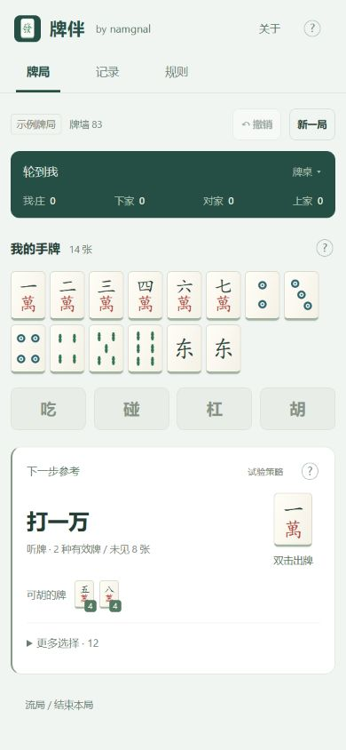

# 牌伴 · 家庭版

手机优先的家庭麻将记牌与决策参考工具。作者：[namgnal](https://github.com/namgnal)。

**[在线试用](https://paiban-family.pages.dev/)** · **[反馈问题](https://github.com/namgnal/paiban-family/issues)** · **[作者主页](https://github.com/namgnal)**

如果牌伴对你有帮助，欢迎给仓库点一个 **Star**，或者带着具体牌例来提建议。无需登录即可使用网页；Star 完全自愿。



## 这个版本做什么

从开局完整记录自己的手牌和各家公开操作，提供出牌、吃碰杠等建议，支持撤销纠错。界面、计算与存档都在当前设备上，不调用云端 AI，不上传牌局。

- 独立吃、碰、杠、胡入口，双击建议牌快速记录出牌。
- 普通胡、小七对、清一色、家庭十三烂，以及本项目约定的积分规则。
- 展示未见张数、本局积分流水；支持 JSON 文件和文字备份导入导出。
- PWA 离线缓存，首次通过 HTTPS 完整加载后可添加到手机主屏幕。

**这是特定家庭规则的小版本，不是通用麻将裁判。** 不包含日麻、四川、南昌等其他规则。具体范围见[家庭规则](docs/rules.md)。建议采用启发式策略，不是真实胜率、精确积分期望，也不保证实桌收益，详见[算法与边界](docs/algorithm.md)。

## 手机使用

1. 在浏览器打开 [在线版](https://paiban-family.pages.dev/)，完整加载一次。
2. 在浏览器菜单选择“安装应用”或“添加到主屏幕”；也可打开右上角“？”查看安装入口。
3. 选择庄家、录入起手牌，按提示记录摸打。首次可点击“先体验示例牌局”。

牌局只保存在当前浏览器。换设备、清除浏览器数据或开始新局前，请导出需要保留的记录。当前自动保存一局，不会跨设备同步。不同浏览器和安卓设备的安装入口可能不同。

## 本地运行

需要 Node.js 22.12 以上（建议使用受支持的 LTS 版本）。

```sh
npm ci
npm run dev
```

开发服务器默认使用 5173 端口；开发模式不提供离线缓存。构建与预览：

```sh
npm test
npm run build
npm run check:release
npm start
```

预览默认使用 4173 端口，也可通过 `PAIBAN_PORT` 环境变量指定。Windows 可在构建后双击“启动牌伴.cmd”。手机连接电脑同一 Wi-Fi 后可使用启动窗口中的地址预览；局域网 HTTP 不能代替正式 HTTPS 离线安装。

## 自行部署

运行 `npm run build` 后，把 `dist/` 中的构建结果部署到静态 HTTPS 托管。Cloudflare Pages 支持直接上传。若同一输出目录曾构建过旧版，请根据 `dist/build-files.json` 的文件清单打包当前版本，避免将残留旧资源混入发布包。

本项目不需要数据库、账号服务或 API 密钥。构建会生成带版本缓存的 Service Worker；新版就绪后提示刷新，不在录牌途中自动切换。自建站点使用自己的本地存储，不会自动迁移官方在线版的存档。

## 项目结构

| 目录或文件 | 内容 |
| --- | --- |
| `src/game.js`、`src/rules.js` | 牌局状态与家庭规则结算 |
| `src/hand.js`、`src/advisor.js` | 牌型、牌效适配与启发式建议 |
| `src/main.js`、`src/style.css` | 手机界面与交互 |
| `src/worker.js` | 在 Worker 中执行计算 |
| `tests/` | 判胡、结算、轮转、存档和交互逻辑回归 |
| `scripts/` | 构建缓存、发布检查与策略实验 |

## 来源与许可

普通向听计算复用 [kobalab/majiang-core 1.4.1](https://github.com/kobalab/majiang-core/tree/v1.4.1)，其 MIT 许可和作者声明保留在 [第三方声明](public/third-party-notices.txt)。家规适配、记牌状态、界面和建议排序见本仓库实现。

本项目采用 [MIT 许可证](LICENSE)，Copyright (c) 2026 namgnal。使用、修改和分发时请遵守 MIT 及所用第三方组件的许可要求。

分享时欢迎附上作者主页、仓库和在线试用链接。请勿将独立改版冒充作者发布的版本；署名和其他义务以正式许可证及第三方许可为准。
